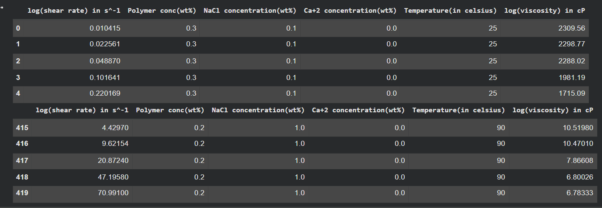
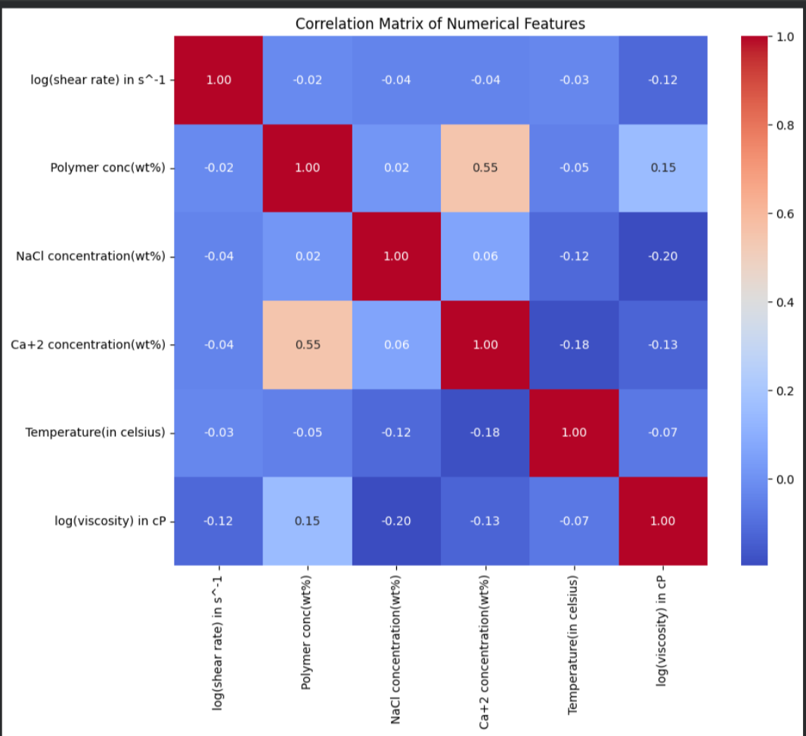
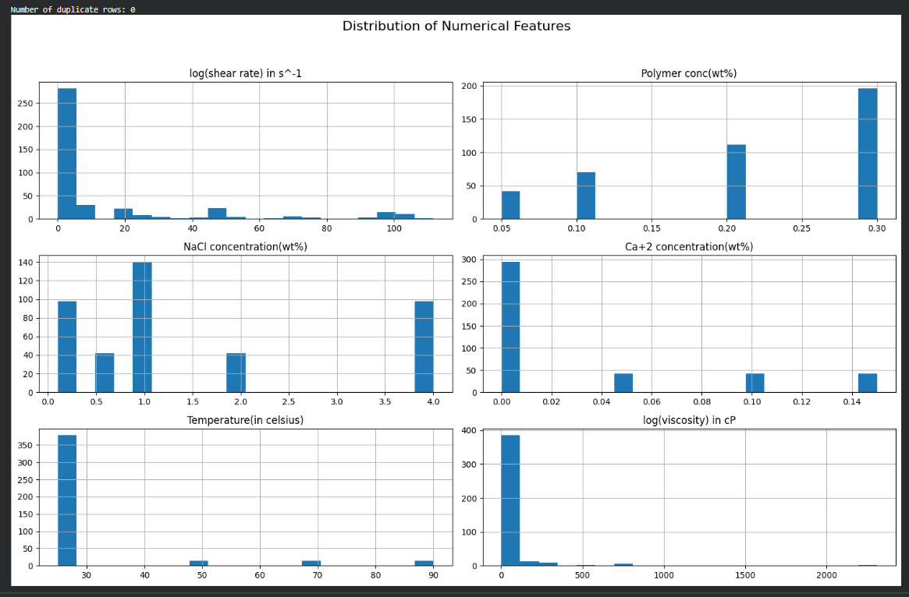

# 🧪 Predicting Polymer Viscosity Using Machine Learning

## 📌 Overview

This project focuses on predicting **polymer viscosity** using Machine Learning techniques.

The goal is to analyze polymer-related experimental data, perform data preprocessing and feature engineering, and develop regression models capable of predicting viscosity on unseen data.

Several regression models were evaluated, including **Linear Regression, Random Forest Regressor, and Gradient Boosting**. Hyperparameter optimization was performed using `RandomizedSearchCV` to improve the performance of the Random Forest model.

---

## 🎯 Objectives

- Analyze and preprocess the polymer viscosity dataset
- Perform Exploratory Data Analysis (EDA)
- Identify and handle potential outliers
- Perform feature engineering
- Create polynomial and interaction features
- Train multiple regression models
- Compare model performance
- Optimize the Random Forest model using hyperparameter tuning
- Evaluate the final model on unseen test data

---

## 🔄 Project Workflow

1. Data Loading
2. Data Cleaning and Preprocessing
3. Exploratory Data Analysis
4. Outlier Detection and Treatment
5. Feature Engineering
6. Train-Test Split
7. Model Training
8. Model Evaluation
9. Hyperparameter Optimization
10. Final Model Selection

---

# 📊 Dataset Overview

The dataset contains experimental measurements related to polymer solutions under different experimental conditions.

### Target Variable

`log(viscosity) in cP`

### Features

- `log(shear rate) in s^-1`
- `Polymer conc(wt%)`
- `NaCl concentration(wt%)`
- `Ca+2 concentration(wt%)`
- `Temperature(in celsius)`
- `log(viscosity) in cP` — Target Variable

### Dataset Information

- **Total Samples:** 420
- **Numerical Features:** 6
- **Duplicate Rows:** 0

---

# 🔎 Exploratory Data Analysis

Exploratory Data Analysis (EDA) was performed to understand the structure of the dataset, relationships between variables, and distributions of the numerical features.

---

## 📋 Sample Data

The following visualization shows the first and last few observations from the dataset.

<p align="center">
  
</p>

The dataset contains measurements for different combinations of:

- Shear rate
- Polymer concentration
- NaCl concentration
- Ca²⁺ concentration
- Temperature
- Polymer viscosity

---

## 📈 Correlation Analysis

A correlation matrix was used to investigate the relationships between the numerical features and the target variable.

<p align="center">
  
</p>

### Key Observations

- `Polymer conc(wt%)` shows a positive correlation with `log(viscosity) in cP`.
- `NaCl concentration(wt%)` shows a negative correlation with the target variable.
- `log(shear rate) in s^-1` shows a negative relationship with viscosity.
- `Ca+2 concentration(wt%)` shows a moderate positive correlation with polymer concentration.
- Temperature shows a relatively weak linear relationship with the target variable.

Correlation analysis was also used to guide the feature engineering process.

---

## 📊 Distribution of Numerical Features

Histograms were used to visualize the distributions of the numerical variables in the dataset.

<p align="center">
  
</p>

The distributions show that several numerical features have skewed or uneven distributions. This highlights the importance of appropriate preprocessing, feature transformation, and feature engineering.

---

# 🧹 Data Preprocessing

The dataset was analyzed and prepared before applying machine learning algorithms.

### Outlier Handling

Potential outliers were identified in the:

`log(viscosity) in cP`

feature.

Winsorization was applied using the **0.5th and 99.5th percentiles** to reduce the influence of extreme observations while retaining the majority of the data.

Further investigation can be performed to determine whether these percentile thresholds are optimal.

---

# ⚙️ Feature Engineering

Feature engineering was performed to help the models capture additional relationships within the dataset.

The following types of features were explored:

- Polynomial features
- Interaction features
- Squared features
- Feature combinations

Examples include:

- `interaction_polymer_NaCl`
- `polymer_squared`

Correlation analysis was performed to understand the relationship between the engineered features and the target variable.

---

# 🤖 Machine Learning Models

The following regression models were evaluated:

## 1. Linear Regression

Linear Regression was used as the baseline model.

| Metric | Score |
|---|---:|
| R² | 0.2778 |
| MSE | 84504.2876 |
| RMSE | 290.6962 |

The relatively low R² indicates that a simple linear relationship is not sufficient to accurately capture the behavior of polymer viscosity.

---

## 2. Random Forest Regressor

Random Forest was used to capture nonlinear relationships between the input variables and polymer viscosity.

### Validation Performance

| Metric | Score |
|---|---:|
| R² | 0.9947 |
| MSE | 620.8497 |
| RMSE | 24.9169 |

### Test Performance

| Metric | Score |
|---|---:|
| R² | **0.9307** |
| MSE | **2013.3289** |
| RMSE | **44.8701** |

The optimized Random Forest achieved strong predictive performance on the held-out test dataset.

---

## 3. Gradient Boosting

Gradient Boosting was also evaluated as a nonlinear regression model.

| Metric | Score |
|---|---:|
| R² | 0.9939 |
| MSE | 712.8910 |
| RMSE | 26.7000 |

---

# 📊 Model Comparison

| Model | R² | MSE | RMSE |
|---|---:|---:|---:|
| Linear Regression | 0.2778 | 84504.2876 | 290.6962 |
| Random Forest | **0.9307** | **2013.3289** | **44.8701** |
| Gradient Boosting | 0.9939 | 712.8910 | 26.7000 |

> **Note:** The Random Forest result shown above is the held-out test performance. The reported Gradient Boosting result should be interpreted according to the dataset split used during its evaluation. For a strict comparison, all models should be evaluated on the same held-out test set.

---

# 🔧 Hyperparameter Optimization

`RandomizedSearchCV` was used to optimize the Random Forest Regressor.

The best hyperparameters obtained were:

- `n_estimators = 200`
- `min_samples_split = 2`
- `min_samples_leaf = 1`
- `max_depth = 30`

These parameters produced the best Random Forest performance during the hyperparameter search.

---

# 🏆 Best Model

Based on the **held-out test set**, the optimized Random Forest Regressor achieved:

| Metric | Score |
|---|---:|
| **R²** | **0.9307** |
| **MSE** | **2013.3289** |
| **RMSE** | **44.8701** |

An R² score of **0.9307** indicates that the model explains approximately **93.07% of the variance** in the target variable on the held-out test set.

---

# 🔍 Key Insights

### 1. Nonlinear Models Perform Better

The large improvement over Linear Regression indicates that polymer viscosity has complex and nonlinear relationships with the input variables.

### 2. Feature Engineering Is Important

Polynomial and interaction features were explored to help the models capture relationships that may not be represented by the original features.

### 3. Outlier Treatment

Winsorization was applied to reduce the influence of extreme viscosity values. However, alternative outlier treatment methods should also be investigated.

### 4. Model Evaluation

The difference between validation and test performance demonstrates the importance of evaluating models on unseen data.

### 5. Data Distribution

Several numerical features exhibit skewed or uneven distributions, suggesting that preprocessing and feature transformation may play an important role in improving model performance.

---

# 🚀 Future Improvements

Future work could include:

- Testing alternative outlier detection methods
- Experimenting with different winsorization thresholds
- Exploring additional feature interactions
- Using domain knowledge to create meaningful features
- Testing additional regression algorithms
- Performing more extensive hyperparameter optimization
- Applying consistent cross-validation across all models
- Experimenting with feature scaling and transformation
- Performing feature importance analysis
- Using SHAP for model interpretability
- Testing the final model on additional unseen datasets

---

# 🛠️ Technologies Used

- Python
- Pandas
- NumPy
- Matplotlib
- Seaborn
- Scikit-learn
- Google Colab
- Jupyter Notebook

---

# 📁 Project Structure

```text
Predicting-Polymer-Viscosity/
│
├── Correlation.png
├── Data_sample.png
├── Distribution.png
├── README.md
├── polymer.csv
└── polymer.ipynb
